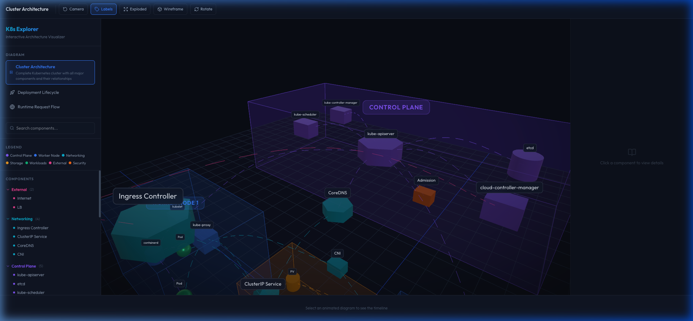
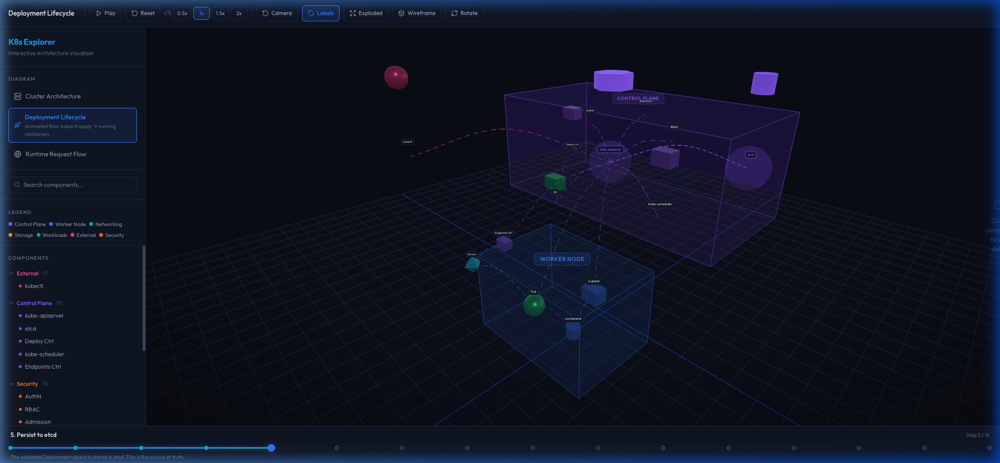
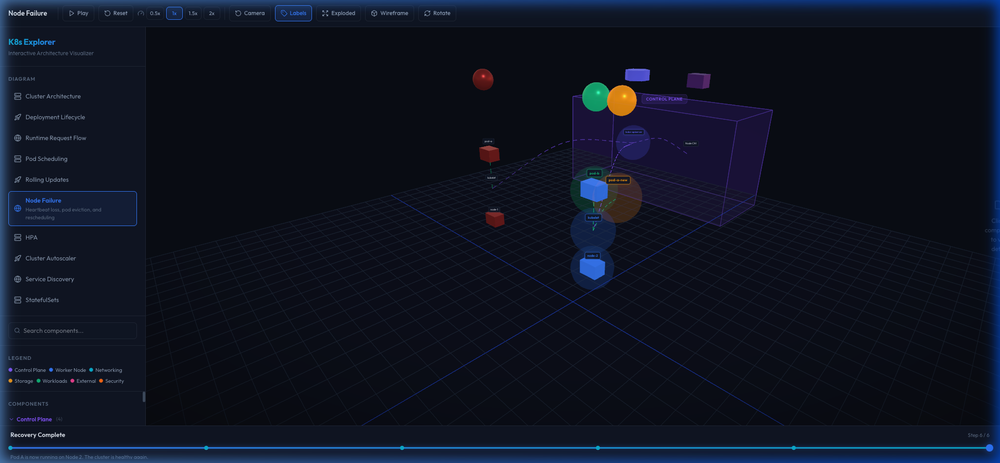

# K8s Architecture Explorer

An interactive, 3D educational web application that teaches Kubernetes architectures visually. Built with React, Three.js, React Three Fiber, and GSAP. 

The application offers a fully immersive environment where users can rotate, zoom, and pan around a 3D representation of a Kubernetes cluster while watching animated request flows and advanced operational scenarios.

## Screenshots

<div align="center">
  
  <p><em>Interactive 3D Cluster Architecture Overview</em></p>
</div>

<div align="center">
  
  <p><em>Animated Deployment Lifecycle with Timeline Scrubber</em></p>
</div>

<div align="center">
  
  <p><em>Advanced Scenarios: Simulating Node Failure & Rescheduling</em></p>
</div>

## Features

- **Interactive 3D Engine:** High-performance, procedurally generated 3D views of the Kubernetes Control Plane and Worker Nodes.
- **Animation System:** Animated packets traveling along Catmull-Rom spline paths to visualize data flow and operational steps.
- **Timeline Scrubber:** Auto-advancing playback controls with timeline seeking to effortlessly follow complex orchestrations step-by-step.
- **Modular Data-Driven Scenarios:**
  - Cluster Architecture
  - Deployment Lifecycle
  - Runtime Request Flow
  - Pod Scheduling
  - Rolling Updates
  - Node Failure
  - Horizontal Pod Autoscaler (HPA)
  - Cluster Autoscaler
  - Service Discovery
  - StatefulSets
- **Context-Rich Info Panel:** Click any component to reveal its responsibilities, YAML examples, `kubectl` commands, debugging tips, and common interview questions.

## Technology Stack

- **Framework:** React + Vite
- **Language:** TypeScript
- **3D Graphics:** Three.js, React Three Fiber (@react-three/fiber), Drei (@react-three/drei)
- **Animations:** GSAP
- **State Management:** Zustand
- **Styling:** Custom CSS (glassmorphism UI) with TailwindCSS integration

## Getting Started

### Prerequisites
- Node.js (v18 or higher)
- npm or yarn

### Installation

1. Clone the repository
2. Install the dependencies:
   ```bash
   npm install
   ```
3. Start the development server:
   ```bash
   npm run dev
   ```
4. Open your browser and navigate to `http://localhost:5173` (or the port specified by Vite).

### Building for Production

To create a production-ready build:
```bash
npm run build
```
The output will be available in the `dist` directory.

## Contributing

The scenarios are entirely data-driven! You can easily add new architectures or animation flows by creating new data definitions in the `src/data/` directory and registering them in `registry.ts`.
